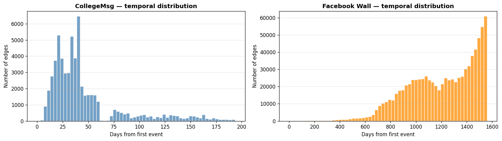
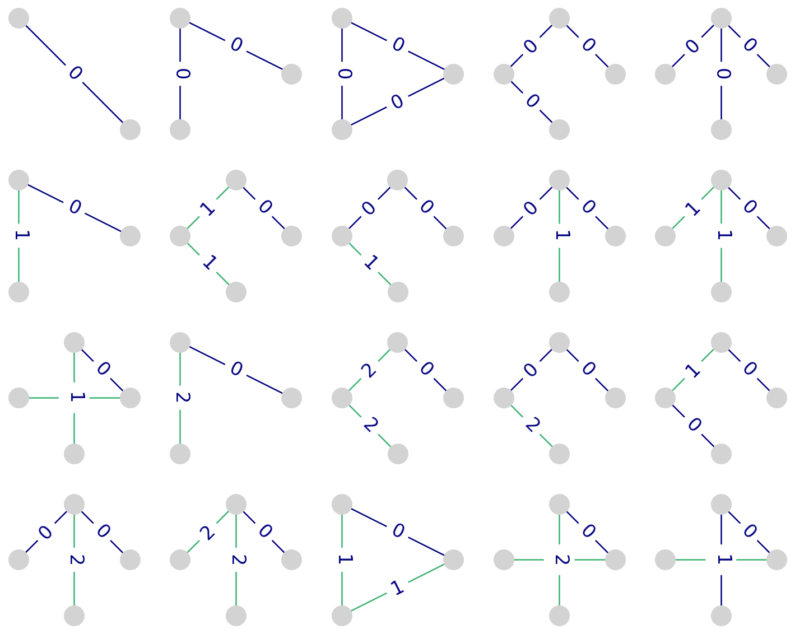
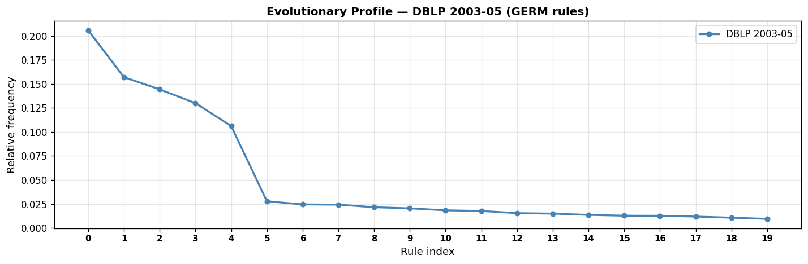
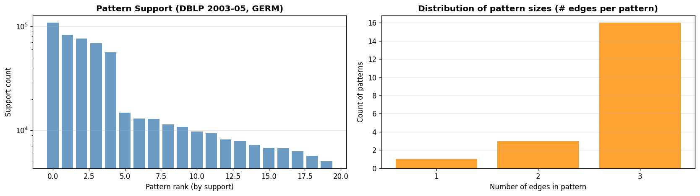
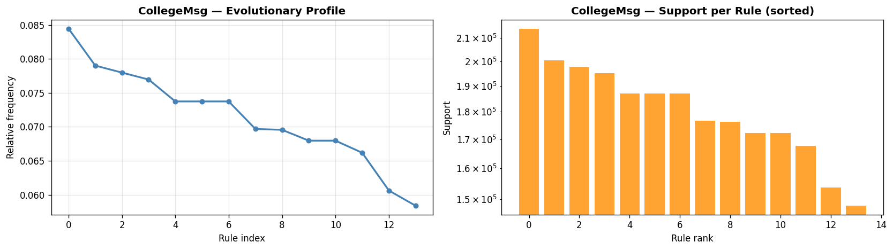
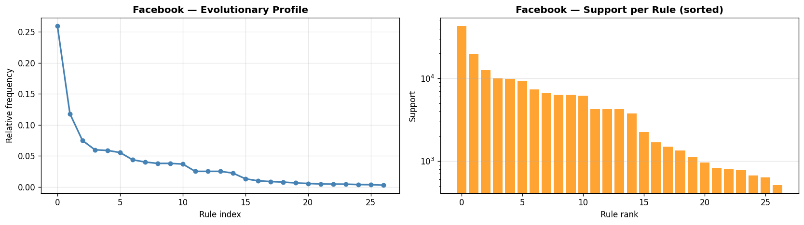
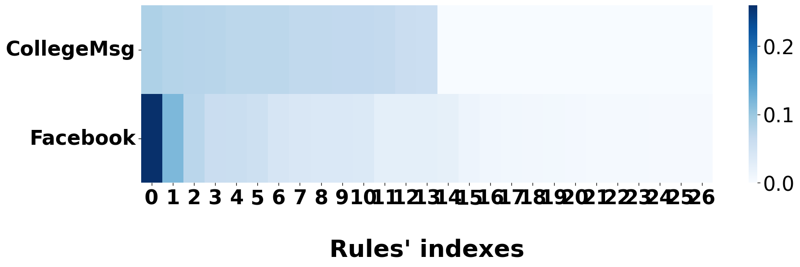

# Report Task 2 — EvoMine: Mining Graph Evolution Rules in Temporal Networks

**Tirocinio universitario:** "Profili evolutivi multilivello di reti complesse tramite temporal network motif"  
**Data:** 2026-05-12  
**Autore:** Carlo Invernizzi  
**Paper di riferimento:** Galdeman, Zignani, Gaito — *"Unfolding temporal networks through statistically significant graph evolution rules"*, IEEE DSAA 2023  
**Toolkit:** GERANIO (repository della correlatrice)

---

## Indice
1. [Obiettivo e contesto](#1-obiettivo-e-contesto)
2. [Algoritmo EvoMine](#2-algoritmo-evomine)
3. [Dataset](#3-dataset)
4. [Setup e criticità tecniche](#4-setup-e-criticità-tecniche)
5. [Risultati — DBLP 2003-05 (output precomputed GERM)](#5-risultati--dblp-2003-05-output-precomputed-germ)
6. [Risultati — CollegeMsg](#6-risultati--collegemsg)
7. [Risultati — Facebook Wall](#7-risultati--facebook-wall)
8. [Confronto tra i due dataset](#8-confronto-tra-i-due-dataset)
9. [Confronto con MTM/TMC (Task 1)](#9-confronto-con-mtmtmc-task-1)
10. [Conclusioni](#10-conclusioni)

---

## 1. Obiettivo e contesto

Il Task 2 analizza gli stessi due dataset del Task 1 (CollegeMsg e Facebook Wall) con un approccio diverso: invece di contare pattern ricorrenti in una finestra temporale fissa (come TMC/MTM), si minano **Graph Evolution Rules (GERs)** — regole predittive che descrivono come un sottoinsieme di archi evolve nel tempo.

La domanda centrale è:

> **Dato che un certo sottoinsieme di archi esiste al tempo t, quali nuovi archi appariranno con alta probabilità in un momento successivo?**

---

## 2. Algoritmo EvoMine

### 2.1 Definizione di GER

Una Graph Evolution Rule ha la forma:

```
Precondizione (body, t=0)  →  Postcondizione (head, t>0)
```

- La **precondizione** (body) è il sottoinsieme di archi osservati al tempo t=0.
- La **postcondizione** (head) è l'insieme di nuovi archi che appariranno a t=1, 2, …

Il **supporto** di una regola è il numero di match distinti nel grafo, misurato con il **MIB (Minimum Image-Based) support**, che evita l'overcounting di match sovrapposti — lo standard nel frequent subgraph mining.

### 2.2 Pipeline

```
Dataset grezzo → Conversione in formato GER → EvoMine binary → Output regole
       → Parsing → Mapping canonico → Profilo evolutivo → Visualizzazione
```

1. **Conversione GER:** il dataset viene convertito nel formato `t # 0 / v <id> / e <src> <dst> <ts_bucket>`. I timestamp vengono **discretizzati in bucket** (giorni o settimane) — fondamentale: EvoMine non accetta Unix epoch.
2. **Mining:** il binary C++ enumera i sottografi frequenti e le loro evoluzioni.
3. **Profilo evolutivo:** vettore di frequenze relative per ciascuna regola trovata — permette il confronto tra dataset.

### 2.3 Parametri principali

| Parametro | Valore usato | Significato |
|-----------|-------------|-------------|
| `-s` (support) | 20000 (CollegeMsg), 500 (Facebook) | Soglia di frequenza minima |
| `-e` (max_edges) | 3 | Max archi nella postcondizione |
| `-T full` | full | MIB support completo |
| `-t` | — | Modalità temporale |
| `-d` | — | Grafo diretto |

### 2.4 Due algoritmi nel toolkit GERANIO
- **GERM**: per grafi non diretti (usato sul dataset DBLP precomputed).
- **EvoMine**: estende GERM a grafi diretti, rimozione archi, grafi con label.

---

## 3. Dataset

### Distribuzione temporale



| Dataset | Archi | Nodi | Span | Bucket usati |
|---------|-------|------|------|-------------|
| **CollegeMsg** | 59,835 | 1,899 | 193.7 giorni | Giornalieri (1..194) |
| **Facebook Wall** (campione) | 10,000 | 3,757 | ~82 settimane | Settimanali (1..82) |

**CollegeMsg** mostra un picco di attività nei primi 50 giorni (probabilmente l'inizio del semestre), poi un calo netto con un secondo picco minore intorno al giorno 75-125. **Facebook Wall** ha una crescita monotona sull'arco di 4+ anni, tipica di una piattaforma social in espansione.

---

## 4. Setup e criticità tecniche

### 4.1 Compatibilità binari
I binari `evomine` e `germ` sono **Linux x86-64 ELF** — non girano nativamente su macOS ARM64. Soluzione adottata: **Docker Desktop** con immagine `ubuntu:22.04`.

```bash
docker run --rm -w /EvoMine \
  -v /path/to/EvoMine:/EvoMine ubuntu:22.04 \
  bash -c "/EvoMine/algorithms/evomine -s 20000 -e 3 -T full -t -d \
  -f /EvoMine/input-files/collegemsg_ger.txt \
  > /EvoMine/output-files/collegemsg_raw.txt 2>&1"
```

### 4.2 Discretizzazione dei timestamp
Il problema più critico incontrato: EvoMine crea uno **snapshot del grafo per ogni timestamp unico**. Con timestamp Unix epoch (es. 1082040961), questo genera 59,835 snapshot → out of memory (exit 137).

**Soluzione:** discretizzare i timestamp in bucket prima della conversione:
```python
bucket = (ts - ts_min) // 86400 + 1   # bucket giornalieri per CollegeMsg
bucket = (ts - ts_min) // 604800 + 1  # bucket settimanali per Facebook
```

### 4.3 Support threshold per CollegeMsg
Con support=1000 e support=5000, il mining si bloccava su singoli pattern candidati per ore (complessità NP-hard dell'enumerazione di sottografi). La soglia support=20000 ha permesso di ottenere risultati in pochi secondi.

---

## 5. Risultati — DBLP 2003-05 (output precomputed GERM)

Il toolkit GERANIO include un output GERM precomputed sul dataset di co-authorship DBLP 2003-2005 (support=5000, max_edges=3, non diretto).

### Statistiche

| Metrica | Valore |
|---------|--------|
| Regole trovate | 20 |
| Support range | 5,054 — 109,044 |
| Support mediano | 10,297 |
| Peso totale | 529,964 |

### Gallery delle 20 regole



Gli archi **blu** sono la precondizione (t=0), gli archi **verdi** sono la postcondizione (t>0). Le prime 5 regole (riga 1) hanno t-span=0: sono sottografi statici senza postcondizione esplicita. Le righe successive mostrano vere evoluzioni body→head.

### Profilo evolutivo



Decadimento quasi a legge di potenza: le prime 5 regole pesano ~74% del supporto totale. Forte drop tra la regola 4 (~0.107) e la regola 5 (~0.028).

### Distribuzione supporto e dimensione pattern



16 delle 20 regole hanno 3 archi totali; 3 ne hanno 2; solo 1 ne ha 1.

### Analisi T-Span


- T-span 0 (25%): pattern statici, tutti gli archi a t=0
- T-span 1 (40%): evoluzione immediata al passo successivo
- T-span 2 (35%): evoluzione in 2 passi temporali

### Esempio di regola visualizzata


La regola mostra una catena di 4 nodi (precondizione) → stessa struttura mantenuta (postcondizione). Regola 3 con support=68,876.

---

## 6. Risultati — CollegeMsg

**Parametri:** support=20000, max_edges=3, directed, bucket giornalieri



### Statistiche

| Metrica | Valore |
|---------|--------|
| Regole trovate | **14** |
| Support range | 147,998 — 214,115 |
| Support mediano | 181,792 |
| Peso totale | 2,535,031 |
| Top 5 support | 214,115 / 200,320 / 197,696 / 195,113 / 186,933 |

### Osservazioni

- Il profilo evolutivo è **piatto**: la frequenza relativa varia solo tra 0.058 e 0.085, senza una regola dominante.
- I valori di supporto sono molto alti e ravvicinati: tutte le 14 regole hanno supporto tra 148k e 214k — nessuna domina sulle altre.
- Questa uniformità riflette la natura della rete CollegeMsg: piccola (1,899 nodi), densa (alta densità locale), con pattern di interazione equilibrati tra tutti gli utenti.
- La scala lineare nel grafico di supporto (non logaritmica) conferma che la variazione tra i valori è contenuta.

---

## 7. Risultati — Facebook Wall

**Parametri:** support=500, max_edges=3, directed, bucket settimanali, campione 10,000 archi



### Statistiche

| Metrica | Valore |
|---------|--------|
| Regole trovate | **27** |
| Support range | 510 — 43,467 |
| Support mediano | 4,225 |
| Peso totale | 167,433 |
| Top 5 support | 43,467 / 19,753 / 12,554 / 10,024 / 9,865 |

### Osservazioni

- Il profilo evolutivo segue una **legge di potenza**: la regola 0 pesa ~26% da sola, poi decadimento rapido verso zero.
- La scala logaritmica nel grafico di supporto è necessaria: la regola più frequente (43,467) ha un supporto ~85× maggiore dell'ultima (510).
- Facebook trova più regole (27 vs 14) anche con un campione molto più piccolo rispetto a CollegeMsg, suggerendo maggiore **varietà strutturale** nelle interazioni.
- La coda lunga riflette la natura scale-free della rete Facebook.

---

## 8. Confronto tra i due dataset



L'heatmap è la visualizzazione più rivelatrice. I profili sono **strutturalmente opposti**:

| Aspetto | CollegeMsg | Facebook Wall |
|---------|-----------|--------------|
| **Forma del profilo** | Piatto, uniforme | Legge di potenza, dominato dalla regola 0 |
| **Regole trovate** | 14 (support=20,000) | 27 (support=500) |
| **Support range** | 147k–214k (lineare, compatto) | 510–43,467 (logaritmico, ampio) |
| **Regola dominante** | Nessuna (~8.5% max) | Regola 0 (~26%) |
| **Distribuzione potere** | Equalitaria | Concentrata |
| **Interpretazione** | Rete piccola e densa, interazioni bilanciate | Rete grande scale-free, pochi pattern dominano |

**Lettura dell'heatmap:**
- **CollegeMsg** (riga superiore): le colonne 0–13 hanno intensità uniforme (~0.07 ciascuna) — il blu è distribuito.
- **Facebook** (riga inferiore): colonne 0–1 in blu scuro (~0.26 e ~0.12), poi quasi zero — concentrazione estrema.
- Le colonne 14–26 di CollegeMsg sono zero (la rete ha solo 14 regole); le stesse colonne per Facebook hanno frequenze quasi nulle (coda lunga).

Questa differenza è coerente con quanto osservato nel Task 1 con TMC/MTM: CollegeMsg mostra una struttura di interazione più omogenea, Facebook una dinamica più eterogenea con pochi pattern dominanti.

---

## 9. Confronto con MTM/TMC (Task 1)

| Dimensione | MTM / TMC (Task 1) | EvoMine / GERM (Task 2) |
|-----------|-------------------|------------------------|
| **Obiettivo** | Contare pattern ricorrenti | Minare regole predittive body→head |
| **Output** | Vettore di conteggi / enrichment score | Lista di regole con supporto MIB |
| **Causalità** | Osservazionale: co-occorrenza in finestra δ | Predittiva: precondizione → postcondizione |
| **Direzione** | Solo directed (MTM) | Entrambe (EvoMine=directed, GERM=undirected) |
| **Modello temporale** | Timestamp esatti, sliding window δ | Timestamp discretizzati in bucket |
| **Pattern** | Sottografi k-nodo a dimensione fissa | Variabile: body (t=0) + head (t>0) |
| **Misura supporto** | Conteggio grezzo | MIB (Minimum Image-Based) |
| **Significatività** | Confronto con null models (shuffle) | Soglia minima di frequenza |
| **Paper** | Paranjape et al. 2017 / Liu & Sarıyüce KDD 2023 | Galdeman et al. IEEE DSAA 2023 |

**Complementarietà:** TMC/MTM risponde a "quali pattern esistono e sono significativi?"; EvoMine risponde a "dato un pattern, cosa accadrà dopo?". Sono strumenti complementari per il profilo evolutivo multilivello.

---

## 10. Conclusioni

1. **EvoMine mina regole causali**, non solo pattern ricorrenti — la postcondizione rende le regole direttamente interpretabili come predizioni.

2. **I due dataset hanno dinamiche evolutive opposte:**
   - CollegeMsg: profilo piatto, nessuna regola dominante — la rete evolve in modo uniforme.
   - Facebook: profilo a legge di potenza, una regola domina — l'evoluzione è eterogena e concentrata.

3. **Limitazioni pratiche:** i binary EvoMine/GERM sono Linux x86-64 ELF, incompatibili con macOS ARM64. Il workaround Docker è funzionale ma impone vincoli sul support threshold (support troppo basso → run di ore). Con support=20000 su CollegeMsg si ottengono solo le regole più frequenti; un server Linux permetterebbe soglie più basse e risultati più ricchi.

4. **Connessione con la tesi:** i profili evolutivi GER (vettori di frequenze relative delle regole) possono essere usati esattamente come i profili TMC del Task 1 — come rappresentazione vettoriale della rete per task di classificazione, clustering o confronto multilivello.
